# yolo

针对InternVL对图片中物体数量识别有误的情况，先用yolo将想要识别的物体切割出来，然后输入MHACoT。

将图片中的物体切割出来进行提问。

| 模型                                                                              | 尺寸 (像素) | mAPval 50-95 | 速度 CPU ONNX (毫秒) | 速度 T4 TensorRT10 (毫秒) | 参数 (M) | FLOPs (B) |
| :-------------------------------------------------------------------------------- | :---------- | :----------- | :------------------- | :------------------------ | :------- | :-------- |
| [YOLO11x](https://github.com/ultralytics/assets/releases/download/v8.3.0/yolo11x.pt) | 640         | 54.7         | 462.8 ± 6.7         | 11.3 ± 0.2               | 56.9     | 194.9     |

将yolo所有可以检测的物体列表提取

检测结果

修改prompt

question1--强调 "inside the bounding box"，并将 "interacts" 改为 "is designed to interact" (因为图中无人)

question3-从 "Describe... in the image" (描述图中现状) 改为 "Predict the most likely interaction" (预测潜在交互)

新的回答

读取yolo分割出来的部分（也就是明确告知object所在的区域），然后使用修改后的prompt。针对每个物体单独进行一次问答。

对于第一个回答效果不好，回答说headboard有adjustable massage feature，交互部位直接错了

第二个回答效果很好，交互部位是Mattress，几何特征是smooth, soft surface， 交互是lie down to sleep or rest。

对于additional affordance， Standing on the feet to push the mattress意义不明，需要筛选

更换参数和新的prompt

修改参数：generation_config = dict(max_new_tokens=1024, do_sample=False, num_beams=3)模型在每一步生成时，会同时保留**概率最高的 3 条路径**（候选句子）。等到句子生成结束时，再从这 3 条完整的路径中选出总概率最高的那一条。消除模型幻觉并保留逻辑能力，但是会增加计算量

prompt1：Look at the {label} inside the red bounding box within the panoramic scene. Analyze its spatial relationship with the surroundings.（这里利用了全景图的优势）

prompt2：Considering the spatial context you just analyzed, identify the standard, primary function of this {label}.  Does the visible geometric structure inside the box support this function?(e.g., for a bed, flat surface for sleeping; for a chair, seat and backrest for sitting). Avoid describing rare or hidden features like 'massage' unless clearly visible.

Spatial Context: 1. The bed is not blocked by other furniture.
2. The bed is placed in the center of the room.
3. The bed is not facing a specific direction such as a TV or window.
4. Core Analysis: Considering the spatial context analyzed, the standard, primary function of this bed is to provide a flat surface for sleeping. The visible geometric structure inside the box supports this function, as it is *a bed with a mattress and a striped bedspread*. The bed is placed *in the center of the room*, *not blocked by other furniture*, and is not facing a specific direction such as a TV or window, making *it suitable for sleeping.*

修改后*a bed with a mattress and a striped bedspread， suitable for sleeping*都相当准确。

Spatial Context:

The bed is not blocked by other furniture.

2. The bed is placed in the center of the room.
3. The bed is not facing a specific direction such as a TV or window.
4. Core Analysis: Considering the spatial context analyzed, the standard, primary function of this bed is to provide a flat surface for sleeping. The visible geometric structure inside the box supports this function, as the bed has a flat surface suitable for sleeping. The bed is placed in the center of the room, not blocked by other furniture, and is not facing a specific direction such as a TV or window, which further supports its primary function as a sleeping area.

# uad

点云和fusion得到的部分照片如下

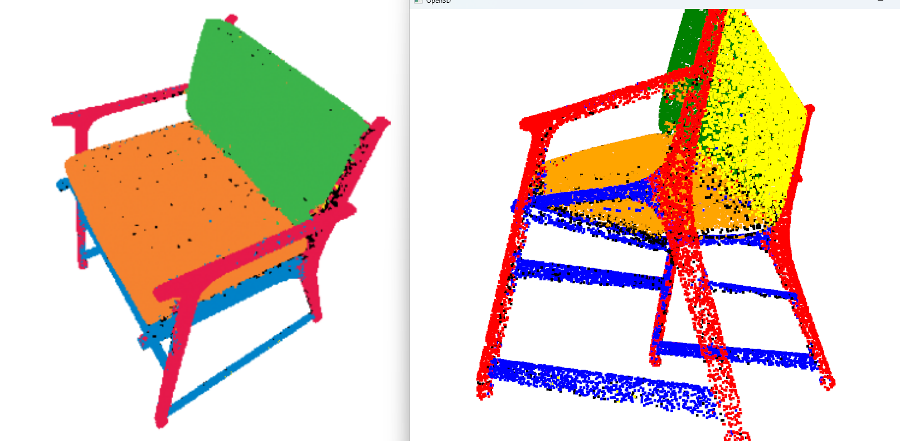

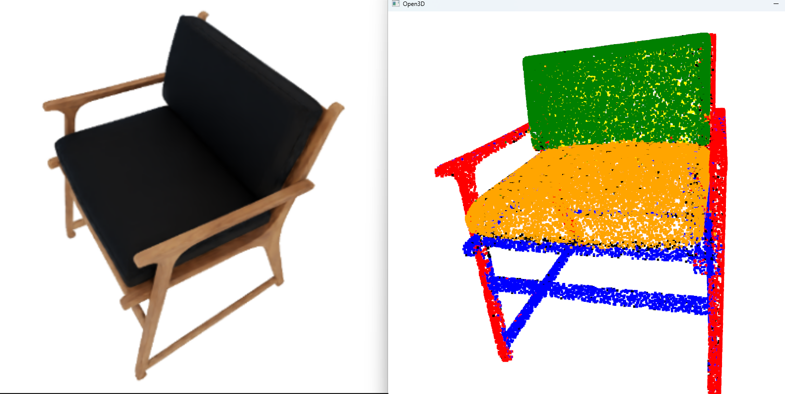

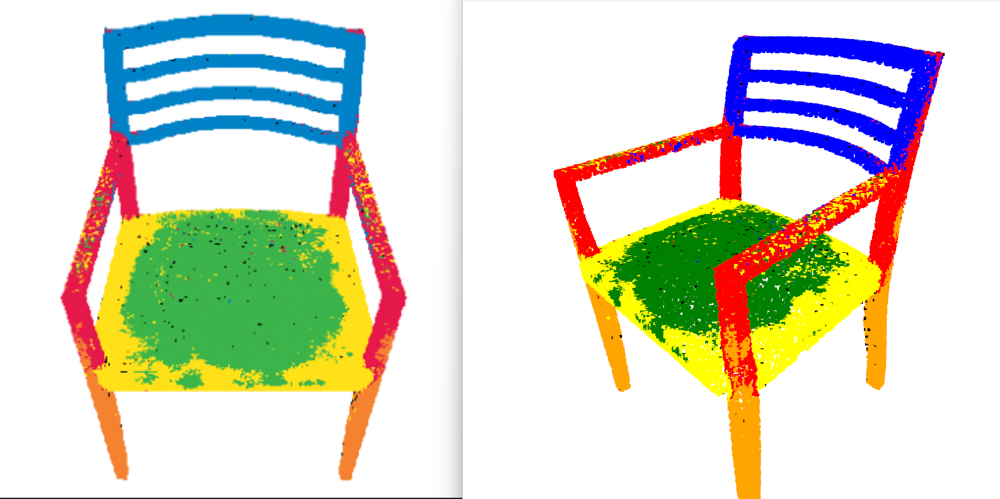

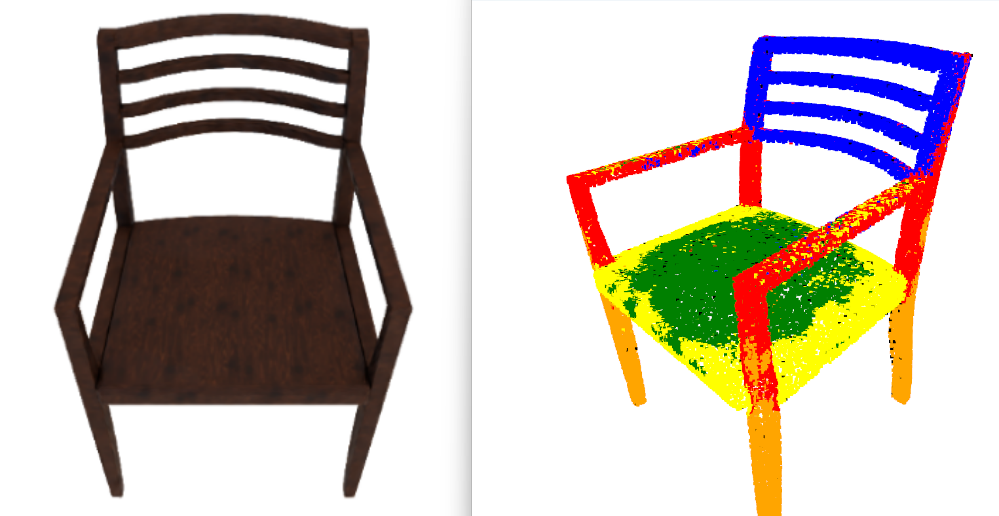

可以看到聚类得到的结果还是比较不错的，各部分比较清晰，点云质量也可以

原先的运行结果（更多的物体）

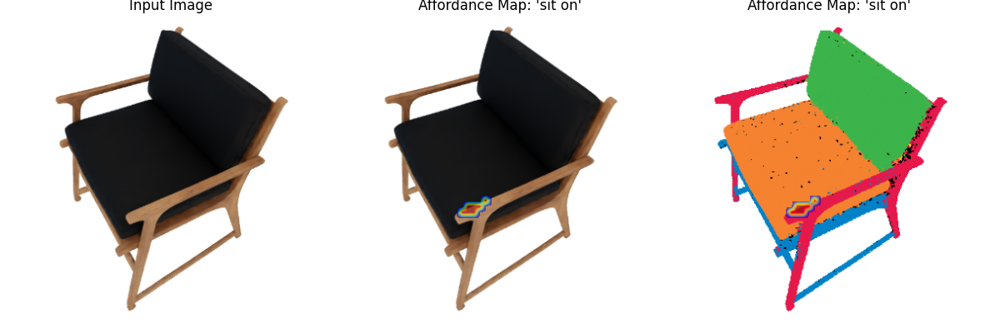

如果使用更长的text_query，那么就热力图区域会直接消失。（上面用的text_query是sit，换成the area to sit on）其中sit对应的是red区域

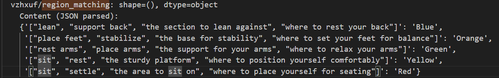

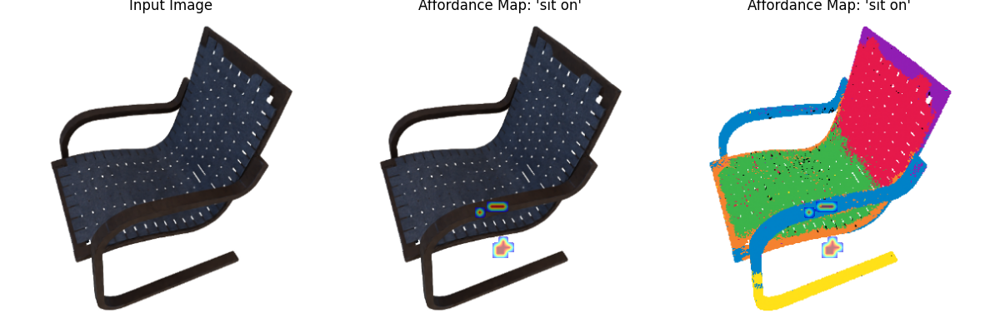

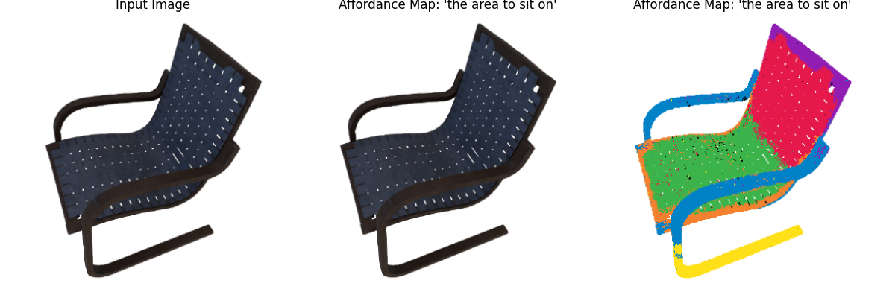

使用dinov2 vit large， 将sentence transformer更改为openai-text-embedding-3-large

原先配置为dinov2 vit small， all-MiniLM-L6-v2

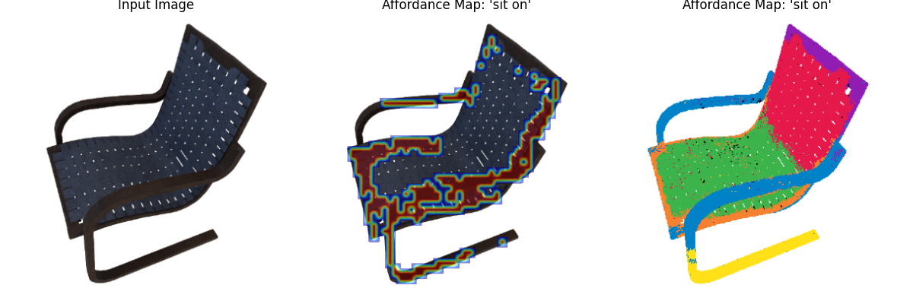

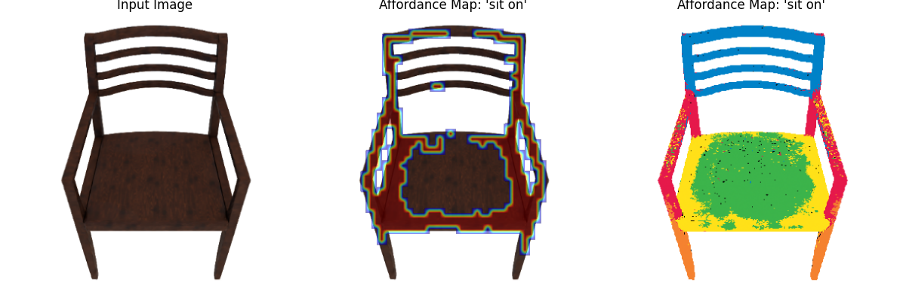

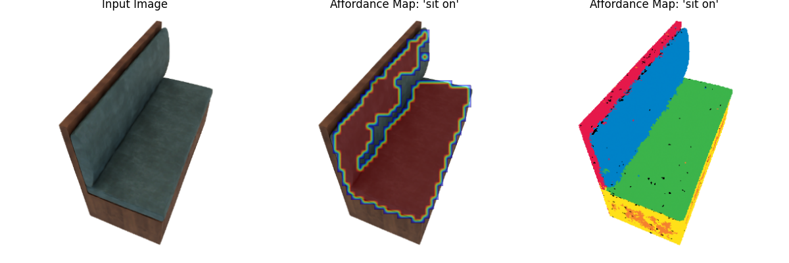

# 网络架构

基于您提供的图像，这是对 `Conv2DFiLMNet` 网络架构及其关键组件的解释：

### 网络总体架构 (Conv2DFiLMNet)

`Conv2DFiLMNet` 是一个神经网络，设计用于同时处理图像和语言输入。

**输入**：

**Image Input**：一个形状为 `(B, 1024, H, W)` 的图像特征张量，其中 B 是批次大小 1。

**Language Embedding**：一个形状为 `(B, 1536)` 的语言特征向量 2。这代表了语言信息的语义嵌入。

**处理流程**：图像输入依次通过三个 `Conv2DFiLMBlock`。每个块都会处理图像特征，并将维数从 `(B, 1024, H, W)` 逐步转换为最终的 `(B, 1, H, W)` 输出 3。

**FiLM Conditioning**：关键在于，`Language Embedding` 被注入到每一个 `Conv2DFiLMBlock` 中，用于调节图像特征的处理过程 4。这种机制被称为 "FiLM Conditioning"（Feature-wise Linear Modulation，特征线性调制）。

### 关键组件详解

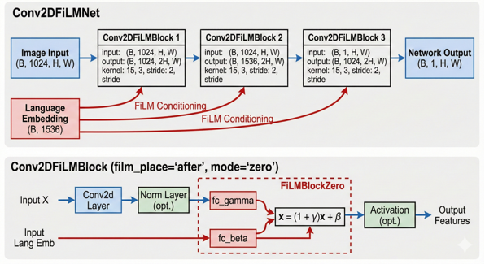

图像下方的 `Conv2DFiLMBlock` 详细图解（配置为 `film_place='after', mode='zero'`）展示了 FiLM 调节的具体工作方式：

1. **Language Embedding 的作用**：

   在每个 `Conv2DFiLMBlock` 内部，`Language Embedding`（图中的 "Input Lang Emb"）被送入一个名为 `FiLMBlockZero` 的模块 5。

   在 `FiLMBlockZero` 内部，语言嵌入通过两个并行的全连接层（`fc_gamma` 和 `fc_beta`）进行处理 6。
2. **Gamma (γ) 和 Beta (β)**：

   `fc_gamma` 层从语言嵌入中计算出调节参数 **gamma (γ)** 7。

   `fc_beta` 层从语言嵌入中计算出调节参数 **beta (β)** 8。

   这些参数是特定于语言输入的，用于对图像特征进行个性化的调节。
3. **FiLM Conditioning (特征线性调制)**：

   + 图像特征（图中的 "Input X"）首先经过卷积层 (`Conv2d Layer`) 和可选的归一化层 (`Norm Layer (opt.)`) 9。
   + 然后，这些中间特征 x 进入 FiLMBlockZero，并应用以下公式进行调节：

     $$
     x = (1 + \gamma)x + \beta
     $$
   + 在这个公式中：

     `x` 是来自图像路径的中间特征图 10。

     **(1 + γ)** 作为一个缩放因子（scale factor），根据语言信息增强或抑制特征 11。由于 `mode='zero'`，γ 初始化接近于0，使得初始调节接近于恒等映射 (1 * x)，网络可以从这里开始学习 12。

     **β** 作为一个平移因子（shift factor），对特征进行偏移 13。

   这种机制允许语言信息通过线性缩放和平移来“指导”网络如何处理图像特征，从而实现基于语言的图像理解或生成任务。调节后的特征随后通过一个可选的激活层 (`Activation (opt.)`) 产生最终的 `Output Features` 14。

   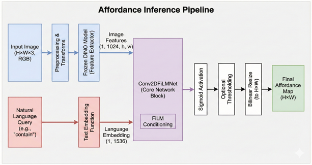

基于您提供的 Python 代码和图像 1，以下是对流程图中特定模块的解释，以及对整个图表正确性的评估：

### 模块解释

1. **Natural Language Query (红色方框)**:

   + **对应代码**: 这是输入到系统的原始文本字符串。在 `inference.py` 的 `main` 函数中，有一个示例查询 `text_query = "contain"` 2。这个字符串随后被作为 `text` 参数传递给 `AffordanceInference.predict` 方法 3。
   + *含义**: 它代表了用户想要在图像中寻找的 affordance（功能可见性）的自然语言描述。
2. **Preprocessing & Transforms (第二个蓝色方框)**:

   **对应代码**: 在 `inference.py` 的 `predict` 方法中，原始图像 `img_np` 首先经过 `transform_imgs` 函数进行处理：`proc = transform_imgs(img_np, blur=False)[0]` 4。

   **含义**: 这一步涉及将输入的 RGB 图像转换为适合输入到冻结的 DINO 模型所需的格式，可能包括标准化、调整大小或其他必要的变换。
3. **Text Embedding Function (红色方框)**:

   **对应代码**: 在 `inference.py` 中，`AffordanceInference` 类在初始化时接收一个 `text_embedding_func` 5。在 `predict` 方法中，这个函数被用来将自然语言查询转换为向量：`lang_emb = torch.from_numpy(self.text_embedding_func(text))` 6。配置文件决定了具体使用哪种嵌入方法（例如，来自 OpenAI 的嵌入）7。

   **含义**: 这个模块负责将人类可读的文本查询转换为一个高维的数值向量（Language Embedding，图中所示形状为 (1, 1536)），以便网络能够理解和处理。
4. **Bilinear Resize (白色方框)**:

   **对应代码**: 在 `inference.py` 的 `predict` 方法的最后阶段，网络输出的低分辨率相似度图 `sim_np` 被调整回原始图像的大小 `(H, W)`。这通过 `torchvision.transforms.functional.resize` 实现，并明确指定了插值模式：`interpolation=T.InterpolationMode.BILINEAR` 8。

   **含义**: 由于网络核心部分处理的是降采样后的特征图，网络的输出也是低分辨率的。这一步使用双线性插值将预测的 affordance 图放大到与原始输入图像相同的分辨率，以便进行可视化和叠加。

# 数据集处理

### 0. 输入数据准备 (HDF5 文件结构)

在运行此 Pipeline 之前，系统假设你已经有了一个 HDF5 文件（例如 `chair.h5`）。这个文件通常包含多个实例（Instance，比如不同的椅子），每个实例下存储了多视角的原始数据：

* `rgb`: 多视角的彩色图像 (N, H, W, 3)
* `depth`: 对应的深度图 (N, H, W)
* `intrinsics` / `extrinsics`: 相机内参和外参（用于 2D 到 3D 的投影）

---

### 第一阶段：最佳视角筛选 (View Selection via CLIP)

**函数：** [find_best_camera_angle](vscode-file://vscode-app/d:/Microsoft%20VS%20Code/resources/app/out/vs/code/electron-browser/workbench/workbench.html)
**作用：** 并不是所有拍摄角度都能清楚地展示物体。这个阶段利用 **CLIP** 模型找出最能代表该物体类别的“最佳视角”（Top-K）。

1. **读取数据** ：从 HDF5 中读取该实例的所有 RGB 帧。
2. **CLIP 编码** ：

* **文本端** ：将类别名称（如 "chair"）输入 CLIP Text Encoder，得到文本特征向量。
* **图像端** ：将每一帧 RGB 图像输入 CLIP Image Encoder，得到图像特征向量。

1. **相似度计算** ：计算每一帧图像特征与文本特征的 **余弦相似度** 。
2. **排序与保存** ：

* 找出相似度最高的 [top_k](vscode-file://vscode-app/d:/Microsoft%20VS%20Code/resources/app/out/vs/code/electron-browser/workbench/workbench.html)（通常是 3）帧的索引。
* 将 [clip_similarities](vscode-file://vscode-app/d:/Microsoft%20VS%20Code/resources/app/out/vs/code/electron-browser/workbench/workbench.html)（相似度分数）和 [top_k_indices](vscode-file://vscode-app/d:/Microsoft%20VS%20Code/resources/app/out/vs/code/electron-browser/workbench/workbench.html)（最佳帧索引）存回 HDF5。
* *意义：后续的 VLM 标注和可视化将主要基于这几个最佳视角进行，避免使用遮挡严重或角度奇怪的图片。*

---

### 第二阶段：3D 特征融合 (3D Feature Fusion via DINOv2)

**函数：** [process_instance](vscode-file://vscode-app/d:/Microsoft%20VS%20Code/resources/app/out/vs/code/electron-browser/workbench/workbench.html) -> [create_fusion](vscode-file://vscode-app/d:/Microsoft%20VS%20Code/resources/app/out/vs/code/electron-browser/workbench/workbench.html)
**作用：** 将 2D 图片的特征提升到 3D 空间，解决单张图片视角受限和噪声问题。

1. **加载 DINOv2** ：代码加载了 `dinov2_vits14` 模型。DINO 是一种自监督视觉模型，它提取的特征具有极强的语义一致性（例如，不同椅子的腿在特征空间中距离很近）。
2. **逐帧融合** ：

* 遍历实例的所有视角。
* **特征提取** ：将 RGB 图像输入 DINOv2，提取像素级的特征图 (Feature Map)。
* **反投影 (Back-projection)** ：利用深度图 (`depth`) 和相机参数，将 2D 特征图上的每个像素点反投影到 3D 空间的世界坐标系中。
* **融合 (Fusion)** ：在 3D 空间（通常是体素网格或点云）中，将来自不同视角的特征进行累加和平均。
* *结果：得到一个带有丰富语义特征的 3D 点云。*

---

### 第三阶段：3D 无监督聚类 (Unsupervised Clustering)

**函数：** [process_instance](vscode-file://vscode-app/d:/Microsoft%20VS%20Code/resources/app/out/vs/code/electron-browser/workbench/workbench.html) -> [cluster](vscode-file://vscode-app/d:/Microsoft%20VS%20Code/resources/app/out/vs/code/electron-browser/workbench/workbench.html)
**作用：** 在不知道物体有哪些部件的情况下，通过特征相似性自动把物体切分成不同的部分。

1. **降维与聚类** ：

* 对 3D 点云上的 DINO 特征进行 PCA 降维（通常降到 3 维，便于计算和可视化）。
* 使用聚类算法（如 K-Means）将点云划分为若干个簇 (Clusters)。
* *逻辑：因为 DINO 特征具有语义性，所以“椅背”上的点特征相似，会被聚为一类；“椅座”上的点会被聚为另一类。*

1. **生成 Proposal Image** ：

* 将聚类后的 3D 点云投影回 Top-1 视角的 2D 平面。
* 生成一张  **Proposal Image（分割图）** ，图中不同的颜色代表不同的聚类簇（例如红色区域是椅背，绿色区域是椅座）。

1. **保存中间结果** ：

* [color_label_names](vscode-file://vscode-app/d:/Microsoft%20VS%20Code/resources/app/out/vs/code/electron-browser/workbench/workbench.html): 记录用到的颜色名（作为聚类 ID）。
* `color_name_features`: 计算每个簇的平均特征向量。

---

### 第四阶段：特征投影与热力图生成 (Similarity Projection)

**函数：** [process_instance](vscode-file://vscode-app/d:/Microsoft%20VS%20Code/resources/app/out/vs/code/electron-browser/workbench/workbench.html)
**作用：** 将 3D 聚类结果映射回 2D 图像，生成用于可视化的热力图。

1. **计算相似度** ：

* 对于每一个聚类簇（代表一个部件），计算其中心特征与 Top-K 帧中每个像素特征的相似度。

1. **生成热力图** ：

* 生成 `similarity_projections`，形状为 `(num_clusters, 3, H, W)`。
* 这意味着对于每个部件（如椅背），我们都有它在 3 个最佳视角下的热力图分布。

1. **存入 HDF5** ：将这些投影数据存入 HDF5，供后续训练或可视化使用。

---

### 第五阶段：VLM 语义标注 (Semantic Labeling via GPT-4V)

**函数：** [process_category](vscode-file://vscode-app/d:/Microsoft%20VS%20Code/resources/app/out/vs/code/electron-browser/workbench/workbench.html) -> [get_end_to_end_matching](vscode-file://vscode-app/d:/Microsoft%20VS%20Code/resources/app/out/vs/code/electron-browser/workbench/workbench.html)
**作用：** 目前我们只知道“红色区域”和“绿色区域”，这一步是让大模型告诉我们“红色是椅背”。

1. **准备 Prompt** ：

* 输入两张图： **原始 RGB 图** （Top-1 视角）和  **Proposal Image** （聚类分割图）。
* 构造 Prompt：“请看这两张图。图 2 是图 1 的分割掩码。请告诉我，图 2 中的红色区域对应图 1 中的什么部件？绿色区域是什么？”

1. **获取响应** ：

* GPT-4V 返回一个 JSON 字典，例如：`{"Red": ["backrest", "back"], "Green": ["seat", "cushion"]}`。
* 这就是代码中的 [region_matching](vscode-file://vscode-app/d:/Microsoft%20VS%20Code/resources/app/out/vs/code/electron-browser/workbench/workbench.html)。

1. **存入 HDF5** ：将这个映射关系存入 HDF5。

---

### 第六阶段：文本特征提取 (Text Embedding)

**函数：** [process_category](vscode-file://vscode-app/d:/Microsoft%20VS%20Code/resources/app/out/vs/code/electron-browser/workbench/workbench.html)
**作用：** 将 VLM 给出的文本标签转化为计算机可理解的向量。

1. **文本编码** ：

* 使用 OpenAI Embedding API 或 SentenceTransformer。
* 将 "backrest"、"seat" 等词转换为高维向量。

1. **最终存储** ：

* 将这些文本向量存入 HDF5 的 `embeddings_oai` 或 `embeddings_st` 组中。

---

### 总结：Pipeline 的最终产出

运行完这个 Pipeline 后，你的 HDF5 数据集就从“只有图片”变成了“带有语义标注的 3D 数据集”。每个实例现在包含了：

1. **[top_k_indices](vscode-file://vscode-app/d:/Microsoft%20VS%20Code/resources/app/out/vs/code/electron-browser/workbench/workbench.html)** : 最好看的几个视角。
2. **`similarity_projections`** : 物体各部件在图像上的精确位置（热力图）。
3. **[region_matching](vscode-file://vscode-app/d:/Microsoft%20VS%20Code/resources/app/out/vs/code/electron-browser/workbench/workbench.html)** : 颜色到语义的字典（红色=椅背）。
4. **`embeddings`** : 部件名称的向量表示。

这个数据集现在可以用来训练下游任务，比如机器人抓取（Affordance Detection），因为它明确知道了物体的每个部分在哪里，以及它叫什么。
