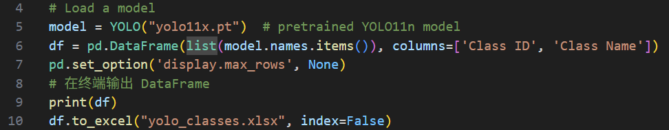
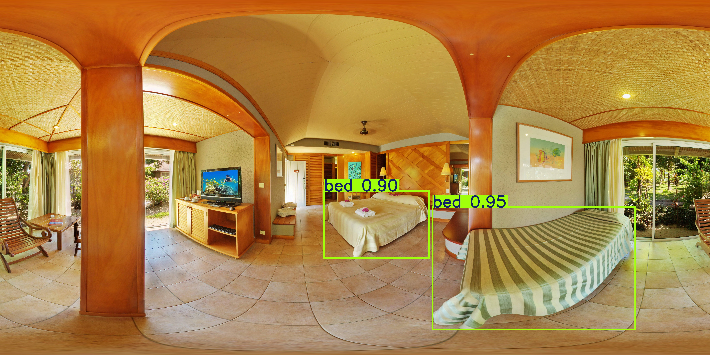
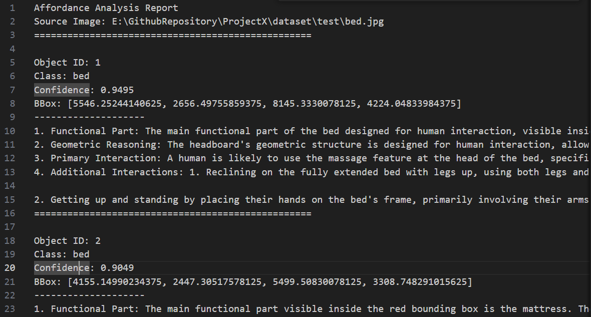

# yolo

针对InternVL对图片中物体数量识别有误的情况，先用yolo将想要识别的物体切割出来，然后输入MHACoT。

将图片中的物体切割出来进行提问。

| 模型                                                         | 尺寸 (像素) | mAPval 50-95 | 速度 CPU ONNX (毫秒) | 速度 T4 TensorRT10 (毫秒) | 参数 (M) | FLOPs (B) |
| :----------------------------------------------------------- | :---------- | :----------- | :------------------- | :------------------------ | :------- | :-------- |
| [YOLO11x](https://github.com/ultralytics/assets/releases/download/v8.3.0/yolo11x.pt) | 640         | 54.7         | 462.8 ± 6.7          | 11.3 ± 0.2                | 56.9     | 194.9     |

将yolo所有可以检测的物体列表提取

检测结果

修改prompt

question1--强调 "inside the bounding box"，并将 "interacts" 改为 "is designed to interact" (因为图中无人)

question3-从 "Describe... in the image" (描述图中现状) 改为 "Predict the most likely interaction" (预测潜在交互)

新的回答

读取yolo分割出来的部分（也就是明确告知object所在的区域），然后使用修改后的prompt。针对每个物体单独进行一次问答。

对于第一个回答效果不好，回答说headboard有adjustable massage feature，交互部位直接错了

第二个回答效果很好，交互部位是Mattress，几何特征是smooth, soft surface， 交互是lie down to sleep or rest。

对于additional affordance， Standing on the feet to push the mattress意义不明，需要筛选
